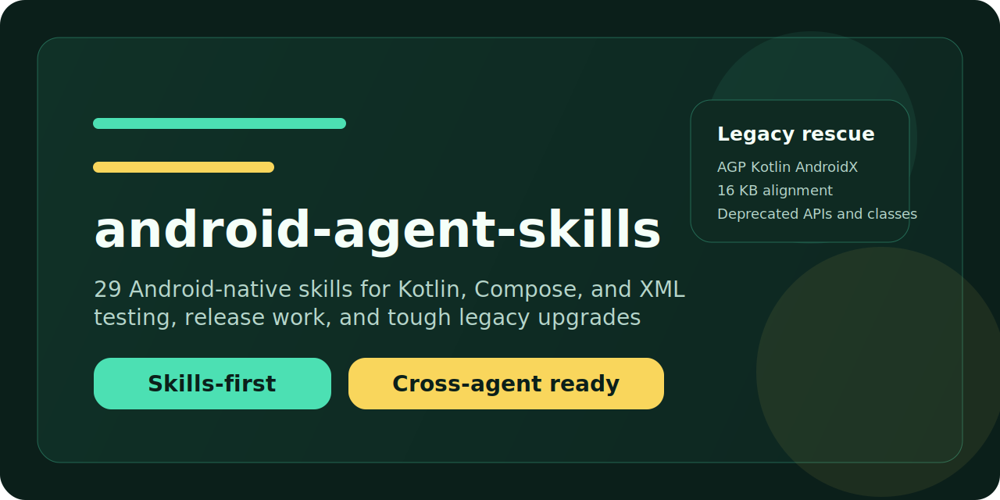

# android-agent-skills



Android skills for people shipping real apps.

Kotlin. Compose. XML. Release work. Ugly legacy upgrades.

An Android skills repository for Codex, Claude Code, and Cursor.

## What makes it useful
- `29` skills built around the jobs Android teams actually do.
- One source of truth in `skills/`.
- Real fixture apps you can build, test, lint, and extend.
- A serious rescue path for old apps through `android-modernization-upgrade`.
- Generated outputs for Codex, Claude Code, and Cursor.

## Plug it in

<details>
<summary>Codex</summary>

```bash
./scripts/install.sh --agent codex --scope user --skill all
```
</details>

<details>
<summary>Claude Code</summary>

```bash
./scripts/install.sh --agent claude --scope user --skill all
```
</details>

<details>
<summary>Cursor</summary>

```bash
./scripts/install.sh --agent cursor --scope project --skill all
```
</details>

## Pick the job

Find the problem. Grab the skill. Move.

## Skill Matrix
| Skill | Focus | Category |
| --- | --- | --- |
| `android-kotlin-core` | Use Kotlin idioms safely in Android apps, including nullability, data classes, sealed types, extension functions, and collection pipelines | `foundations` |
| `android-gradle-build-logic` | Shape Android build logic with Gradle, version catalogs, plugins, convention patterns, and toolchain compatibility | `foundations` |
| `android-architecture-clean` | Apply clean architecture boundaries, use cases, repositories, and lifecycle-aware presentation models in Android projects | `foundations` |
| `android-modularization` | Design Android repositories with feature, core, and build-logic modules that scale without cyclic dependencies | `foundations` |
| `android-di-hilt` | Wire Android dependency injection with Hilt, scopes, testing overrides, and module ownership boundaries | `foundations` |
| `android-coroutines-flow` | Use coroutines, Flow, structured concurrency, dispatchers, and cancellation-safe Android async pipelines | `foundations` |
| `android-state-management` | Model screen state, events, reducers, and side effects for Android UIs with predictable lifecycle-aware ownership | `product` |
| `android-navigation-deeplinks` | Handle navigation graphs, back stack behavior, app links, intents, and destination ownership for Android apps | `product` |
| `android-permissions-activity-results` | Use modern permission requests, Activity Result APIs, and capability-gated UX in Android flows | `product` |
| `android-ui-states-validation` | Review Android UI flows for empty, loading, error, offline, and edge-case behavior before release | `product` |
| `android-compose-foundations` | Build Android UI with Jetpack Compose foundations, layouts, modifiers, theming, and stable component structure | `ui` |
| `android-compose-state-effects` | Manage Compose state, remember APIs, side effects, snapshots, and lifecycle-aware collection without leaks or loops | `ui` |
| `android-material3-design-system` | Apply Material 3 tokens, color, type, spacing, adaptive components, and theme ownership in Android apps | `ui` |
| `android-compose-performance` | Profile and improve Compose recomposition, layout, scrolling, startup, and rendering performance in Android apps | `ui` |
| `android-compose-accessibility` | Make Compose interfaces accessible with semantics, announcements, contrast, focus order, and adaptive touch targets | `ui` |
| `android-viewsystem-foundations` | Handle XML layouts, ConstraintLayout, Fragments, ViewBinding, DataBinding, and classic Android UI lifecycle patterns | `ui` |
| `android-compose-xml-interoperability` | Bridge Compose and the View system safely during incremental migrations, interoperability screens, and shared theming | `ui` |
| `android-room-database` | Model Room entities, DAOs, transactions, migrations, schema exports, and test-safe local persistence | `data-platform` |
| `android-local-persistence-datastore` | Persist lightweight user and app preferences with DataStore, schema-safe models, and migration-aware defaults | `data-platform` |
| `android-networking-retrofit-okhttp` | Build Android networking stacks with Retrofit, OkHttp, interceptors, API contracts, and resilient error handling | `data-platform` |
| `android-serialization-offline-sync` | Coordinate serialization, caching, conflict handling, and offline-first sync flows in Android apps | `data-platform` |
| `android-media-files-sharing` | Use modern Android file, media, picker, FileProvider, and share-sheet APIs with minimal permissions | `data-platform` |
| `android-workmanager-notifications` | Schedule reliable background work, reminders, and notification delivery with WorkManager and Android execution limits | `data-platform` |
| `android-security-best-practices` | Apply Android app security guidance around secrets, storage, network trust, exported components, and least privilege | `quality-release` |
| `android-performance-observability` | Measure startup, rendering, memory, jank, vitals, logs, and crash signals for Android apps with actionable traces | `quality-release` |
| `android-testing-unit` | Write fast, focused Android unit tests for reducers, use cases, repositories, and lifecycle-safe state holders | `quality-release` |
| `android-testing-ui` | Validate Android UI behavior with Compose UI tests, Espresso-style checks, accessibility assertions, and state coverage | `quality-release` |
| `android-ci-cd-release-playstore` | Automate Android CI, versioning, signing boundaries, release channels, and Play-ready delivery workflows | `quality-release` |
| `android-modernization-upgrade` | Bring very old Android projects to a current supported baseline with staged upgrades, deprecated API replacement, 16 KB alignment checks, and explicit handoff to specialized skills | `legacy-rescue` |

## Real fixtures
- `examples/orbittasks-compose` gives you a Compose-first app with filters, reminders, sync state, and test hooks.
- `examples/orbittasks-xml` gives you the View-system version with ViewBinding and migration-ready structure.
- `examples/fixtures/*` keeps broken legacy projects around on purpose so the upgrade skill has something real to rescue.

## Already wired up
- `python3 scripts/validate_repo.py`
- `python3 scripts/eval_triggers.py`
- `python3 scripts/build_adapters.py --agent all`
- GitHub Actions for validation, packaging smoke tests, and Android fixture checks.

## Add a new skill
```bash
python3 scripts/init_skill.py my-new-skill --description "What it does" --category foundations
python3 scripts/validate_repo.py
python3 scripts/build_adapters.py --agent all
```

## Repo layout
```text
skills/                    Canonical skill sources
.claude/agents/            Generated Claude adapters
.cursor/rules/             Generated Cursor rules
examples/                  Compose, XML, and legacy-upgrade fixtures
benchmarks/                Trigger benchmark corpus
scripts/                   Repo automation, validation, release, install
```
